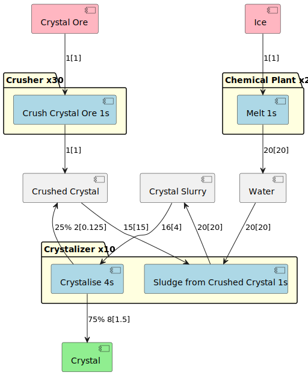
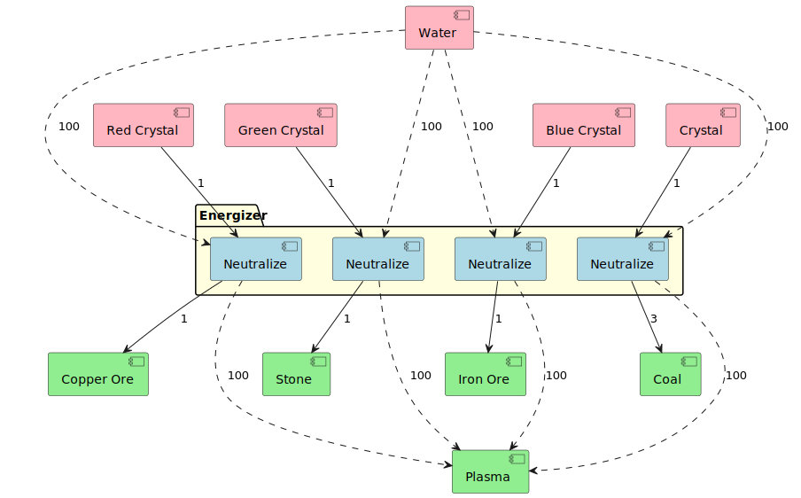
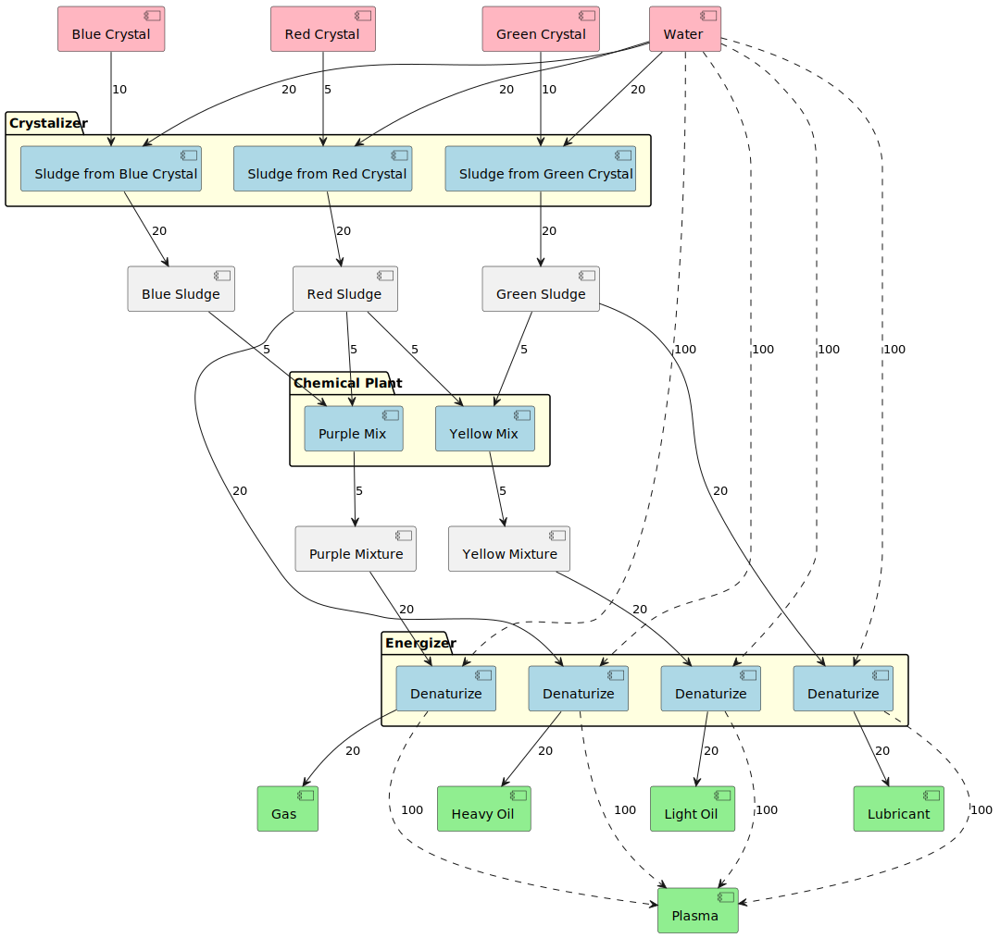
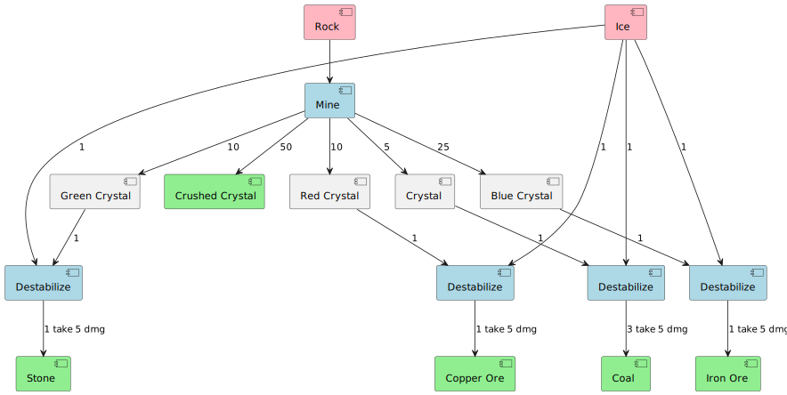

# Crystarion
## Description
Mod to add crystal based planet to factorio.

In the Documentation folder you can find the creation of the base resources.
The main goal of the planet is to use energy management and to add new ways of using and creating power.
The main result should be better laser turrets, more explosive rounds,
smaller power plants and smaller power equipment.

## Todo
* Dynamically create icons
* Try out enemies
  * Spawner on the volcano
  * Do we investigate worms? or biters?
    * I think some gleba enemies die too soon so they could be new-ish
* Why do we need the plasma if we can simply heat water and reuse the things from the default game?
  * investigate what the impact of this would be
* Use rod+ice to create the condensation rod
  * This is the "seed" for ice creation
* Crystaline accumulator to allow for fast accumulator access.
* Planet:
  * Ice planet with lava. Crystals form in high heat (that's science) but the creatures live off of energy
    causing the planet to be cold. So we have vast snow landscape and ice sheets.
  * The ice sheets are planting grounds for the condensation rod
  * Have some lava structures with dirt and grass breaking through the ice. Here we should have
    most of the crystal rocks.
* Biters
  * Creatures are mostly peaceful and do not attack player or structures unless provoked (like peaceful mode).
  * You can build energy lures to lure enemies to them (these generate EMP pollution)
    * Enemies will walk to the lures and settle there. They will transform into structures evolving as they 
      absorb power. Larger structures will generate more resources. 
      * In general we hope to make the power consumption to generate a new enemy to be larger than
        the power that can be created from the ores it spawns pushing players to let them evolve.
      * Check how captive biter spawners are implemented.
    * Perhaps we can let these buildings spawn flyers that attack power structures but I want to work on a 
      player initialized combat.
* Later game:
  * have fancier versions of the machines that cost more fancy crystals
  * Perhaps we could have plasma lakes to create power when the base gets more power hungry
  * Use crystals to superheat steam to 500.
    * Make sure you do not have excess crystals
* To energize crystals, we already thought of having power surges etc.
  * Let it attract flyers (let all energy creating things attract flyers)
  * Make it similar to nuclear reactorss that one damage makes boom
  * If not enough energy in the system, fail
  * Damage all in the connected network based on their stored energy.

## Energy and Resources

There are 2 main resources, Ice and Crystal Ore. Ice can be found in rocks
around the planet and can be shot down from passing ice astroids.
Crystal Ore is found as drops spawned by killed enemies and in rocks scattered around.

For Crystal Ore, you will be able to pick them up and crystalise them into crystals.
These crystals are your power source and your way to create oil and ore products.
However, whenever you create ores or oils, the crystal needs to release it's power.
The energizer works as a battery that needs to release its energy to be able to work.
So the main goal of this planet is to spend your energy.

Energy can be used by enemies to allow them to grow.

Most enemies are laser resistant therefore using laser turrets on them can be an
early game way of losing energy.
In the late game, you will want to balance because the crystaline energisers will
take up a lot of energy.

The main "miner" will be a collector similar to the space station which picks up
things around it from the ground.

### Powered Crystals

We intend to put power into crystals to power them even more. This process has some side effects.
Powering a crystal asks for a power spike.
If the network cannot deliver, the ingredients are lost and the process fails.
If the process succeeds, a power surge is put in the network damaging everything connected to the network.
This will force the player to smartly go about which network are connected to what.

There will be 3 levels of powered crystals each requiring larger and larger amounts of power.
Level 2 creation will cause an explosion in addition to the power surge.
Level 3 creation will cause a small nuclear explosion.
The intention is that the player needs to recreate parts of his base when doing that
just so actual object creation
is needed to keep the base working.

To make it easier to collect energy, we will introduce mega batteries.
They allow us to read the stats of the network and especially how many power is saved.
Mega batteries are an excellent target for flyers and if they are destroyed, guess what explosion.

### Util

* Electric power poles that do not automatically connect to the grid to easy grid separation. 
* Electric power poles that have a single connection do to power a single object.
* Powered floors, the power only flows where the floor is. Visual way of splitting power networks.

## Science

Science uses powered crystals and has levels with the type of powered crystal that is used.

## Enemies
Enemies spawn resources that can be mined when killed. All enemies are of
crystaline nature and power hungry so they are 
100% resistant to energy weapons but very susceptible to explosive damage.

Enemies give tinny bits of ore when killed to push the player to setup elaborate defenses to grow pentapods
and kill them.

As enemies generate crystals and water is abundant on all planets, so it would
be nice to be able to generate eggs for them 
to transport to other planets and allow them to infest the planet.

### Small enemies

There are only small enemies that spawn. They have no intention to 
destroy your base, they try to attach to your power poles and extract energy from your base.
Other enemies will try to attach to attached enemies to create some sort of network.

The network is predefined and enemies tend to walk across those paths to clear them and attach to power nearby.
This will allow the player to predict which paths they need to cover for ore and penta spawning control.
The nodes where pentapods can spawn are also predetermined.

The enemies will use energy to evolve to larger and more sturdy enemies.
In general, all power will be redirected to a penta node, to start the creation of that enemy.
The paths to the penta location will also become more defended with biters
evolving to conduits and some evolving to walls.

Destroying the connection will send all biters in attack mode.

Letting the pentapod spawn, will kill the entire connection and cause a small explosion.

### Big enemies

Big enemies are some sort of crystaline pentapod that does not try to go for
the nearest enegry source, but for the largest one.
When the big enemy is killed, it spawns a circular rich ore patch allowing
for better ores and a reason to let them grow.

### Flyers

Flyers are generic attackers flying towards the biggest power source to seep it and damage it.
They do not spawn ore when killed and are susceptible to laser but not to explosion.

### Weapons

Short range artillery and multiple hits lasers.
#### Artillery
Short range arty is there to allow us to hurl powered crystals towards the enemy exploding on impact.
Cluster, mini-nuke and clustered mini-nuke variants will be available.
Artillery is similar to flamethrowers as in a small arc in a certain direction
(which seems smartest for things that do explosions.)
There should also be a short range artillery piece to hold in your hand

When creating the crystals for ammunition we could break a stable crystal
into unstable parts which are then used to create the ammo.
However, unstable crystals decay and when they do, they go boom.
#### Lasers
Crystal powered laser turret that targets up to 5 enemies. great against flyers.
## Goal
The main goal is to balance energy for feeding enemies to have access to
ores and energy to power the powerhungry processes.

## Creation Flows
### Crystals
The base inputs are Ice and Crystal ore, which are the only resources on the planet.

### Coloured Crystals
Crystals can be split into smaller compounds. These compounds will be used to
create the basic factorio resources.

### Ore Creation
When we have crystals, we can make any ore we want.

### Oils
We also need to be able to create the fluids

### Manual
When we start the game, we need to be able to set things up. So some manual recipes are needed.

### Power
Power needs to be created from plasma. We keep it as simple as possible.

### Upgrade
We need lots of power to upgrade crystals and that will be the main wa of getting science and some later game tools.

